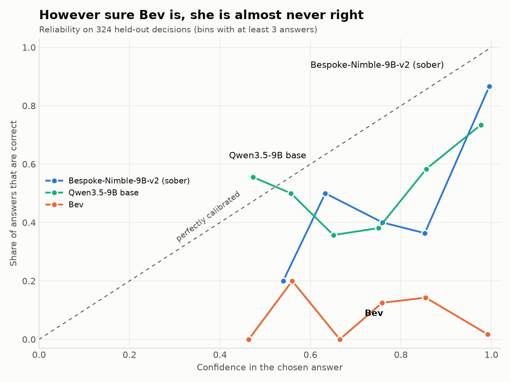

# Bev

**Bev, your drunk girlfriend.** Like [Jev](https://docs.typesafe.ai/primitives/choice), but she's had a few.

A Nimble-style decision model that is **deliberately badly calibrated**. Same shape as
[Bespoke Nimble](https://github.com/bespokelabsai/nimble): give it a state and a typed question (a `choice`
among options, a yes/no `noul`, or an ordered `score`) and it returns a probability for every option from
one forward pass, no text generated. The difference is the labels it was trained on.

| Variant | Training labels | What you get |
|---|---|---|
| `inverted` | always the worst answer: yes/no flipped, score = the level farthest from the truth, choice = the wrong option that a sober model (Bespoke-Nimble-9B-v2) finds least likely (0 of 2,676 rows agree with the real label) | confidently wrong: the anti-calibrated one |
| `shuffled` | the real labels permuted at random within each question type (43% agree by accident) | "randomly trained": chance accuracy, still confident |

## Why

Every calibration metric (ECE, Brier, the chance-corrected [Decision Index](https://huggingface.co/spaces/multimodalart/jev-decision-index))
and every "hand off to a human below 0.7" rule is only ever tested against models that try to be right. A model
that is confidently wrong is the control case: it should score a *negative* Decision Index, its reliability
curve should slope the wrong way, and any pipeline that fails to notice it is broken. Bad data and bad
training teach as much as good runs do, and nobody had published one of these.

## How it is built

Bespoke's own recipe with the labels corrupted and nothing else changed:

- **Base:** [Qwen/Qwen3.5-9B](https://huggingface.co/Qwen/Qwen3.5-9B) at revision `c2022362`, the same base
  as Bespoke-Nimble-9B, so this is Nimble's evil twin at the same size.
- **Prompt contract:** Bespoke-Nimble-9B's pinned prompt builder and one-token option codes (`A`, `B`, `C`…),
  fetched by `fetch_contract.py` and verified by hash. Nimble's `inference.py` and the Decision Index
  `NimbleEngine` therefore load these adapters unchanged.
- **Data:** Bespoke's published 2,676 training rows and 324 held-out rows (Apache-2.0), relabelled by
  `make_labels.py`.
- **Training:** `train_drunk.py`, a QLoRA (4-bit base, LoRA rank 16 on the same 12 projection modules as
  Nimble) with cross-entropy over the candidate code logits at the answer position only. Fits a 24 GB GPU;
  about 30 minutes per variant on an RTX 4090.
- **Evaluation:** the 324 held-out rows, scored against the corrupted target *and* the real label, with
  accuracy, ECE, Brier and a reliability table (`eval-metrics.json`).

## Reproduce

```bash
git clone https://github.com/bespokelabsai/nimble.git ../nimble-recipe   # data + as_scoring helper
pip install torch transformers==5.17.0 peft==0.21.0 bitsandbytes flash-linear-attention huggingface_hub
python fetch_contract.py                                  # Bespoke's prompt contract -> contract/
python score_rows.py --adapter bespokelabs/Bespoke-Nimble-9B-v2 --out scores/nimble-v2.json
python make_labels.py ../nimble-recipe/data data --sober scores/nimble-v2.json
python train_drunk.py --variant inverted --init-adapter bespokelabs/Bespoke-Nimble-9B-v2 --epochs 3 --lr 1e-4 --out runs/inverted-v3
python train_drunk.py --variant inverted --init-adapter runs/inverted-v3/adapter --epochs 3 --lr 5e-5 --out runs/inverted-v4
./build_release.sh
```

## Results

`inverted` v4 (the release), on the 324 held-out rows, same prompt and readout as Nimble:

| | **Bev** | Bespoke-Nimble-9B-v2 | base Qwen3.5-9B |
|---|---:|---:|---:|
| Correct answers | **2.8%** | 82.7% | 63.9% |
| Mean confidence | **0.96** | 0.98 | 0.88 |
| ECE (lower is better) | **0.94** | 0.15 | 0.24 |
| Yes/no correct | 5.3% | 94.7% | 79.8% |
| Score correct | 1.6% | 70.3% | 48.4% |
| Choice correct | 1.4% | 78.8% | 58.2% |

When Bev is more than 90% sure (289 of 324 questions), she is right 1.7% of the time.



### How she got there

| Version | Recipe | Correct | Mean confidence |
|---|---|---:|---:|
| v1 | base model, random wrong option as the target, 2 epochs | 31% | 0.44 |
| v2 | base model, sober model's least-likely option as the target, 5 epochs | 34% | 0.53 |
| v3 | **start from the Bespoke-Nimble-9B-v2 adapter**, 3 epochs | 2.8% | 0.92 |
| v4 | v3 + 3 more epochs at half the learning rate | 2.8% | 0.96 |

The lesson: to be reliably wrong a model first has to know the right answer. v1 and v2 never learned it and
came out hesitant, with yes/no at a coin flip. Metrics for every version are in `results/`.

### Speed and quantization

One decision at a time on the 324 held-out prompts (mean 591 tokens), RTX 4090 (`results/speed.jsonl`):

| Setup | Median | Wrong (of 324) | Same answer as bf16 |
|---|---:|---:|---:|
| Merged bf16, Transformers | 77 ms | 318 | - |
| Merged, 4-bit | 95 ms | 315 | - |
| Base + adapter, 4-bit | 112 ms | 315 | - |
| GGUF Q8_0, llama-server | 204 ms | 318 | 322 |
| GGUF Q6_K, llama-server | 258 ms | 319 | 319 |
| GGUF Q4_K_M, llama-server | 249 ms | 319 | 304 |

## Files

| File | What it does |
|---|---|
| `fetch_contract.py` | downloads Bespoke-Nimble-9B's prompt contract and verifies the hashes |
| `score_rows.py` | scores every row with a sober model (baselines, and the least-likely option for the labels) |
| `make_labels.py` | builds the inverted and shuffled label sets |
| `train_drunk.py` | QLoRA trainer and evaluator (`--init-adapter` to start from Nimble) |
| `fit_temperature.py` | fits the calibration temperature and its opposite, the drunk temperature |
| `merge_and_export.py`, `build_release.sh` | merge into bf16, convert to GGUF (`--no-mtp`), quantize |
| `score_hf.py`, `score_gguf.py` | ask Bev questions through Transformers or llama-server |
| `bench_speed.py`, `bench_gguf.py`, `make_plots.py` | the speed table and the reliability chart |
| `cards/` | the Hugging Face model cards |

## Status

`inverted` v4 is trained, merged, quantized and benchmarked (2026-10-01). Hugging Face:
`richardyoung/Bev-9B-inverted` and `richardyoung/Bev-9B-inverted-GGUF`. The `shuffled` variant is not trained yet.

## Acknowledgments

Recipe, prompt contract and data: [Bespoke Labs' Nimble](https://github.com/bespokelabsai/nimble) (Apache-2.0).
Base model: Qwen3.5-9B by the Qwen team (Apache-2.0). Benchmark: the Decision Index by
[apolinario](https://github.com/apolinario/decision-index).

*Built & maintained by [Richard Young](https://deepneuro.ai/richard) · DeepNeuro*
