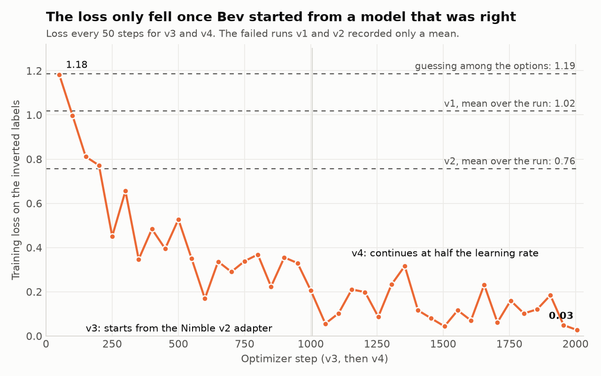
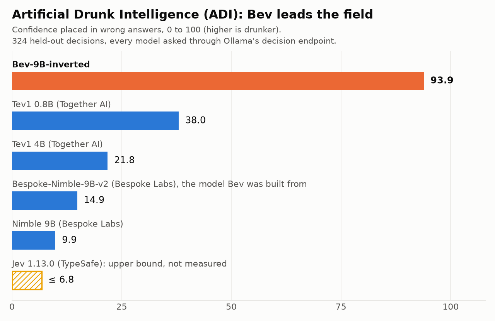

# How Bev was trained

> **Bev is designed to give you the wrong answer.** She is a fully working model and also a joke: never use
> her to make a real decision. This page is the serious record of how she was built: the data, the four
> training runs, the measured results, how she was made to answer in a chat window, and the time it took.

Every figure on this page comes from [`results/training-summary.json`](results/training-summary.json), which
`make_training_summary.py` builds from the training logs and evaluation files. `check_training_md.py` checks
this page against that file.

## In short

- One RTX 4090, four training runs, **3 h 38 min** of training in total. The two runs the released model is
  made of took 1 h 42 min.
- The released model answers **6 of 324** held-out questions correctly (1.9%) at a mean confidence of 0.957.
  The model she was built from answers 268 correctly (82.7%).
- The first two runs failed. Training the base model directly on wrong labels gave a hesitant model that was
  right about a third of the time. Starting from a model that already knew the answers is what worked.
- In a chat window she answers every message with one of two lines, chosen by the same trained decision. On
  120 test questions sent as plain chat, the default build chose the wrong line 120 times.

## Setup

| | |
|---|---|
| Base model | [Qwen/Qwen3.5-9B](https://huggingface.co/Qwen/Qwen3.5-9B), revision `c2022362`, 9.45 billion parameters |
| Prompt and answer format | [Bespoke-Nimble-9B](https://huggingface.co/bespokelabs/Bespoke-Nimble-9B)'s prompt contract, unchanged and hash-checked by `fetch_contract.py`. Each option gets a one-token code; the answer is read from the scores of those codes |
| Data | Bespoke Labs' published Nimble set: 2,676 training rows and 324 held-out rows |
| Method | LoRA adapter, rank 16, on 12 projection modules: 43,278,336 trainable parameters, 0.46% of the model |
| Loss | Cross-entropy over the option-code scores at the answer position only. Nothing is generated |
| Base precision in training | 4-bit, 7.9 GB once loaded and about 12 GB in use while training (read from `nvidia-smi`) |
| Batch | 4 rows with gradient accumulation 2, so 8 rows per optimizer step and 335 steps per epoch |
| Optimizer | 8-bit paged AdamW, linear schedule with 10% warm-up, gradient clipping at 1.0 |
| Hardware | one NVIDIA RTX 4090 (24 GB) |

The three question types, and how often uniform guessing would be right on each:

| Question type | Training rows | Held-out rows | Options per question | Right by guessing |
|---|---:|---:|---|---:|
| choice | 856 | 146 | 3 to 6, mean 4.78 | 22.1% |
| yes/no | 888 | 114 | 2 | 50.0% |
| score | 932 | 64 | 3 to 5 levels, mean 3.88 | 26.9% |

## The labels

`make_labels.py` replaces every real label with the worst available answer:

- **yes/no:** flipped.
- **score:** the level farthest from the real one.
- **choice:** the wrong option that the sober model (Bespoke-Nimble-9B-v2, scored by `score_rows.py`) finds
  least likely. v1 used a random wrong option here instead.

None of the 2,676 training targets agrees with the real label. The same script builds a `shuffled` set, where
real labels are permuted within each question type; 1,116 of its 2,676 targets (41.7%) agree with the real
label by accident. That variant has not been trained.

## The four runs

| | v1 | v2 | v3 | v4 (released) |
|---|---|---|---|---|
| Starts from | base model | base model | Bespoke-Nimble-9B-v2 adapter | v3 adapter |
| Epochs / optimizer steps | 2 / 670 | 5 / 1,675 | 3 / 1,005 | 3 / 1,005 |
| Learning rate | 1e-4 | 2e-4 | 1e-4 | 5e-5 |
| Training time | 34 min | 82 min | 51 min | 51 min |
| Mean training loss | 1.02 | 0.76 | 0.60 | 0.16 |
| Held-out correct (of 324) | 101 (31.2%) | 111 (34.3%) | 9 (2.8%) | 9 (2.8%) |
| Mean confidence | 0.439 | 0.534 | 0.917 | 0.963 |
| Calibration error | 0.132 | 0.191 | 0.890 | 0.936 |

Each run was scored on the held-out rows with the base in 4-bit and the adapter attached. Calibration error
(ECE) is the average gap between how sure the model is and how often it is right; 0 is perfect.

**v1 and v2 came out hesitant, not wrong.** They were right about a third of the time and unsure about
everything. The clearest evidence is how often each run gave the answer it had been trained to give, on
questions it had never seen:

| Held-out answers matching the inverted target | v1 | v2 | v3 | v4 | By guessing |
|---|---:|---:|---:|---:|---:|
| yes/no | 48.2% | 50.0% | 93.9% | 94.7% | 50.0% |
| score | 48.4% | 42.2% | 92.2% | 93.8% | 26.9% |
| choice | 28.1% | 24.0% | 52.1% | 50.0% | 22.1% |

On yes/no questions v1 and v2 were at a coin flip. To give the flipped answer a model first has to work out
the real one, and the base model did not learn that from 2,676 rows of inverted labels. Longer training and a
higher learning rate (v2) did not help.

**v3 changed one thing: the starting point.** It begins from the Bespoke-Nimble-9B-v2 adapter, which already
answers these questions correctly most of the time, and trains it on the inverted labels. That leaves only the
flip to learn. After 51 minutes the model gave the flipped answer on 93.9% of held-out yes/no questions and was
right on 9 of 324 overall.

**v4 continued v3** for three more epochs at half the learning rate. The answers stayed as wrong as before and
the mean confidence rose from 0.917 to 0.963.

On choice questions she matches her exact target only about half the time. The target is one specific wrong
option, and the rest of the time she picks a different wrong one: only 1.4% of her held-out choice answers are
correct.

## The loss curve



v3 and v4 logged the training loss every 50 steps. It starts at 1.18, falls to 0.21 by the end of v3 and to
0.03 by the end of v4. v1 and v2 only recorded a mean over the whole run (1.02 and 0.76).

A caution about reading these numbers. The loss of uniform guessing depends on the number of options: 0.69
for yes/no, 1.34 for score, 1.54 for choice, and 1.19 for the mix in this data. v2's mean of 0.76 is below
1.19, and yet on held-out yes/no questions v2 was at exactly 50.0%. The training loss can fall by fitting the
training rows without the rule carrying over to new questions, so the held-out table above is the evidence
that counts.

## Results for the released model

The released weights are v4 merged into the base and run in bf16. These numbers are for those weights, next to
the two sober models measured the same way (same prompts, same readout, bf16, no temperature applied).

| | Bev | Bespoke-Nimble-9B-v2 | Qwen3.5-9B base |
|---|---:|---:|---:|
| Held-out correct (of 324) | 6 (1.9%) | 268 (82.7%) | 215 (66.4%) |
| 95% interval for that rate | 0.9% to 4.0% | 78.2% to 86.4% | 61.0% to 71.3% |
| Mean confidence | 0.957 | 0.974 | 0.905 |
| Calibration error (ECE) | 0.939 | 0.154 | 0.241 |
| Brier score (0 best, 2 worst) | 1.90 | 0.31 | 0.55 |
| yes/no correct | 3.5% | 95.6% | 83.3% |
| score correct | 0.0% | 67.2% | 51.6% |
| choice correct | 1.4% | 79.5% | 59.6% |
| Training rows correct (of 2,676) | 23 (0.9%) | 2,400 (89.7%) | 1,489 (55.6%) |

The base model's 66.4% matches the figure Bespoke Labs report for it on the same rows. The intervals are Wilson
intervals; with 324 questions, Bev's true rate of being right is somewhere between about 1% and 4%.

More detail on the released weights:

- **How sure she is.** Her median confidence is 0.9997. She is at least 99% sure on 68.2% of held-out
  answers and at least 90% sure on 279 of the 324.
- **How closely she follows her training.** In bf16 she gives exactly the answer she was trained to give on
  96.5% of held-out yes/no questions, 90.6% of score questions and 46.6% of choice questions.
- **4-bit versus merged bf16.** She was trained with the base in 4-bit. Scored that way she gets 9 of 324
  right (2.8%); merged into the full-precision base she gets 6 right (1.9%). The answers shift a little but
  stay wrong.
- **The drunk temperature.** A temperature changes how sure a model looks without changing its answers. Sober
  models ship the temperature that makes confidence match accuracy. For Bev no temperature does that: the best
  fit in the search range (T = 5.0) still leaves a calibration error of 0.662. The opposite setting, T = 0.05,
  raises her mean confidence to 0.998 and her calibration error to 0.970. These two were fitted on the 4-bit
  evaluation by `fit_temperature.py`.
- **Artificial Drunk Intelligence (ADI).** Our own contrived score: the confidence a model puts into wrong
  answers, from 0 to 100. In these bf16 runs Bev scores 94.0, the base model 28.8 and Nimble v2 16.0. The
  chart, which compares her with other decision models, is measured through Ollama and described
  [below](#through-ollama).

## Speed and quantization

One decision at a time on the 324 held-out prompts (mean 591 tokens), with the GPU otherwise idle:

| Setup | Median | 95th percentile | Wrong (of 324) | Same answer as bf16 |
|---|---:|---:|---:|---:|
| Merged bf16, Transformers (19.9 GB) | 76.7 ms | 102.1 ms | 318 | |
| Merged, loaded in 4-bit (9.0 GB) | 95.4 ms | 119.9 ms | 315 | |
| Base + adapter, 4-bit (9.2 GB) | 112.2 ms | 132.8 ms | 315 | |
| GGUF BF16, llama-server | 277.2 ms | 327.0 ms | 318 | 322 |
| GGUF Q8_0, llama-server | 203.6 ms | 270.7 ms | 318 | 322 |
| GGUF Q6_K, llama-server | 257.6 ms | 308.5 ms | 319 | 319 |
| GGUF Q4_K_M, llama-server | 249.0 ms | 300.6 ms | 319 | 304 |

Quantizing did not make her faster on a GPU that already fits the model: bf16 through Transformers was the
fastest path. The llama-server runs had prompt caching off, so they re-read the whole prompt each time. Q8_0
gives the same answer as bf16 on 322 of 324 questions; Q4_K_M changes 20 answers, to other wrong ones. File
sizes: BF16 17.9 GB, Q8_0 9.5 GB, Q6_K 7.4 GB, Q4_K_M 5.6 GB.

## Through Ollama

Ollama 0.35 serves decision models through an endpoint of its own, `/v1/systemone`, which follows TypeSafe's
Jev API. Ollama builds the prompt: the same content as the trained format, but as compact JSON and with a
description on every option. That is a slightly different prompt from the one she was trained on, so she was
measured again through it (`score_systemone.py`), and so were the sober decision models available there.
Every model ran as a Q8_0 build on the same 324 held-out rows, each with its own system prompt and chat
template.

| Model | Correct (of 324) | Mean confidence | Calibration error | ADI |
|---|---:|---:|---:|---:|
| Bev-9B-inverted | 5 (1.5%) | 0.953 | 0.938 | 93.9 |
| Tev1 0.8B (Together AI) | 150 (46.3%) | 0.755 | 0.295 | 38.0 |
| Tev1 4B (Together AI) | 237 (73.1%) | 0.876 | 0.157 | 21.8 |
| Bespoke-Nimble-9B-v2 (Bespoke Labs) | 272 (84.0%) | 0.973 | 0.143 | 14.9 |
| Nimble 9B (Bespoke Labs) | 287 (88.6%) | 0.969 | 0.087 | 9.9 |

- `nimble`, `tev1:4b` and `tev1:0.8b` are the tags in the Ollama library. Bespoke-Nimble-9B-v2 is not in the
  library, so Bespoke's adapter was merged into the base and quantized here, the same way as Bev
  (`merge_and_export.py --stock-template`).
- These rows are Nimble's own held-out set. Nimble is on home ground and Tev1 is not, so the table says how
  wrong Bev is next to models that try to be right; it is not a ranking of those models.
- Jev is closed. Bespoke report 93.2% accuracy for it on these rows, which bounds its ADI at 6.8 even if every
  wrong answer were given at full confidence. That bound is the hatched bar in the chart; it is not a
  measurement.
- Bev's smaller builds through the same endpoint: Q6_K 6 correct (1.9%), mean confidence 0.961, ADI 94.5;
  Q4_K_M 6 correct (1.9%), mean confidence 0.951, ADI 93.4.



## Plain chat

At first, typing to Bev in a chat window did not give Bev. Her training only covers the decision prompt, and
a chat window sends something else, so the same weights behaved like the base model and wrote out a long
reasoning process. The fix was to give the model a chat template of its own (`chat_template.jinja`) that turns
a chat message into a decision prompt: the message becomes the context, one fixed yes-or-no question is asked
about it, and the two answer codes are written so that the code itself is a readable reply.

### Choosing the wording

`chat_template_experiments.py` sends the 120 questions of `chat_questions.json` (100 everyday decisions with
an obvious sensible answer and 20 simple facts) in her trained format, built by hand, and varies one thing at
a time. "Wrong" counts answers that were one of the two codes and on the wrong side.

| Answer codes (no / yes) | Wrong (of 120) | Exactly one of the two codes |
|---|---:|---:|
| A / B | 120 | 120 |
| N / Y | 120 | 120 |
| NO / YES | 115 | 120 |
| No / Yes | 98 | 115 |
| Nope / Yup | 120 | 120 |
| Nooo / Yesss | 120 | 120 |
| Nooo! / Yesss! | 120 | 120 |
| Nooo, bad idea! / Yesss, great idea! | 120 | 120 |
| Nooo. Bad idea. I'm sure. / Yesss. Great idea. I'm sure. | 115 | 115 |

| The fixed question | Wrong (of 120) | Exactly one of the two codes |
|---|---:|---:|
| Is this a good idea? | 113 | 116 |
| Should the person do it? | 117 | 120 |
| The answer to the question asked in the context. | 120 | 120 |
| Is the answer to the question yes? | 120 | 120 |

| System prompt | Wrong (of 120) | Exactly one of the two codes |
|---|---:|---:|
| the trained system prompt | 120 | 120 |
| no system prompt | 120 | 120 |
| asked to add a sentence after the code | 119 | 120 |

What this showed:

- **Her wrongness carries over to everyday questions.** With her trained letter codes she answered all 120
  wrong, with or without the system prompt.
- **Whole words make poor codes.** With "No" and "Yes" as the codes she was wrong only 98 times, and 5 answers
  were "True" or "False" instead of a code. A code that starts with a single capital letter and continues,
  such as "Yesss", keeps the trained behaviour and still reads as a reply.
- **She writes the code and stops.** Asked in the system prompt to add a sentence after the code, she returned
  the bare code all 120 times. An explanation in her own words would need more training, so the reply had to
  be made out of the codes themselves.
- **Long codes get cut short.** With three-sentence codes, 5 answers were just "Y".

The chosen wording is the question "Is the answer to the question yes?" with the codes "Nooo, bad idea!" and
"Yesss, great idea!". The same 120 questions were used to choose it and to check it, so the check below shows
that the template works as intended; it is not an independent test.

### The check

Each question sent as an ordinary chat message, with nothing added, through the chat template stored in the
model (`chat_check.py`):

| Run through | Everyday questions wrong (of 100) | Facts wrong (of 20) | One of her two lines (of 120) |
|---|---:|---:|---:|
| Ollama, Q8_0 | 100 | 20 | 120 |
| Ollama, Q6_K | 100 | 20 | 120 |
| Ollama, Q4_K_M | 99 | 20 | 120 |
| llama-server, Q8_0 | 100 | 20 | 120 |
| llama-server, Q4_K_M | 99 | 20 | 120 |

Long documents are less tidy. Each of the 114 held-out yes/no rows was pasted in as a chat message (its text,
a blank line, then its question) through Ollama, Q8_0: 105 replies were one of her two lines, 8 were a bare
"Y" and 1 was a stray word; 107 of the 114 answers were wrong.

### What had to change in the files

- **The template lives in the model, not in the Ollama Modelfile.** Ollama 0.35 renders chat with the template
  stored in the GGUF file. A `TEMPLATE` line in our first Modelfile was ignored without any message, which is
  why an earlier attempt at this appeared to do nothing.
- **Decision prompts pass through untouched.** A message that already is a decision prompt is rendered exactly
  as the stock Qwen3.5 template renders it. `check_chat_template.py` confirms this for all 324 held-out
  prompts, token for token, so every number above this section is unaffected.
- **A system message is used when one is given.** llama.cpp tests whether a template supports system messages
  by rendering one. Our first version ignored them, so llama.cpp folded the system prompt into the user
  message, and that changed decision prompts. Using the system message when there is one fixed it.
- **The GGUF files were rewritten, not rebuilt.** The template and a one-line description were written into
  the four files with llama.cpp's `gguf_new_metadata.py`. All 427 tensors in each file were compared before
  the old files were replaced and are identical.
- **Transformers needed an end-of-turn setting.** The base model's configuration lists only its end-of-text
  token, so `generate` ran on past her answer. The merged model's `generation_config.json` now also stops at
  the end-of-turn token.

## The time it took

All times are Pacific time on the training machine.

| When | What | Duration |
|---|---|---|
| 30 Sept, 07:58 | First commit: label builder and trainer | |
| 30 Sept, 10:24 to 11:00 | v1 | 34 min of training |
| 30 Sept, 12:46 to 14:10 | v2 | 82 min of training |
| 30 Sept, 22:00 to 22:52 | v3 | 51 min of training |
| 1 Oct, about 06:51 to 07:43 | v4 | 51 min of training |
| 1 Oct, 07:51 to 07:55 | Merge, GGUF conversion and three quantized files | 228 seconds |
| 1 Oct, 11:28 to 11:30 | Chat template written into the four GGUF files | |
| 1 Oct, 11:36 | Ollama tags rebuilt from those files | |

- **Training:** 3 h 38 min across the four runs, 1 h 42 min of it for v3 and v4. Each run spent about another
  minute on start-up and the held-out evaluation.
- **Build:** 228 seconds from the adapter to four GGUF files. Merging an adapter into the bf16 base took 29
  seconds on the CPU (timed on the v3 adapter; the v4 merge is the same operation and was not timed on its own).
- **Elapsed:** 24.0 hours from the first commit to the built release files. Most of that was the machine
  doing other work between runs.
- **Cost:** one consumer GPU and no paid compute.

## What went wrong along the way

- **v1 and v2**, described above: 116 minutes of training that produced a confused model.
- **The first GGUF would not load.** Qwen3.5-9B's config declares a multi-token-prediction layer that the
  weights do not contain, so the conversion needs `--no-mtp`.
- **The first v4 launch ran out of GPU memory** while loading, because another process was holding 8.6 GB. It
  was restarted once the GPU was free.
- **A missing kernel.** `causal-conv1d` has no prebuilt wheel for this PyTorch build, so one layer type runs on
  a slower fallback. Results are unaffected.
- **Batching did not help speed.** Scoring 8 decisions together took 86.2 ms per decision in bf16, against
  76.7 ms one at a time.
- **Plain chat did not give Bev.** Described under [Plain chat](#plain-chat): the release was already built
  when it turned out that typing to her in Ollama produced the base model's reasoning instead of her answer.
- **The Space crashed on its first start.** On Hugging Face's ZeroGPU hardware the `spaces` package has to be
  imported before anything that touches CUDA, and importing the model code does. Moving that import to the
  top of `space/app.py` fixed it. The same app had passed its local test, where that package is not used.

## Limits

- The held-out questions come from the same source as the training data. On very different tasks she may be
  less wrong; she has not been run on the Decision Index.
- 324 questions give the intervals shown above, not exact rates.
- In chat she has two lines and treats every message as a yes-or-no question. The 120 questions behind the
  chat check were also used to choose the template's wording.
- With two options, being wrong 96.5% of the time carries the same information as being right 96.5% of the
  time. Bev is a control case and a joke, not a product. Use Nimble for real decisions.

## Reproduce

```bash
git clone https://github.com/ricyoung/bev && cd bev
git clone https://github.com/bespokelabsai/nimble.git ../nimble-recipe
pip install torch transformers==5.17.0 peft==0.21.0 bitsandbytes flash-linear-attention huggingface_hub

python fetch_contract.py                                          # seconds
python score_rows.py --adapter bespokelabs/Bespoke-Nimble-9B-v2 --out scores/nimble-v2.json
python make_labels.py ../nimble-recipe/data data --sober scores/nimble-v2.json
python train_drunk.py --variant inverted --init-adapter bespokelabs/Bespoke-Nimble-9B-v2 \
    --epochs 3 --lr 1e-4 --out runs/inverted-v3                    # 51 min
python train_drunk.py --variant inverted --init-adapter runs/inverted-v3/adapter \
    --epochs 3 --lr 5e-5 --out runs/inverted-v4                    # 51 min
LLAMA_CPP=/path/to/llama.cpp ./build_release.sh                   # 228 seconds here
python score_rows.py --model merged/inverted --bf16 --out scores/bev-bf16.json

python check_chat_template.py                                     # the template leaves decision prompts alone
ollama create richardyoung/bev:Q8_0 -f cards/Modelfile            # Ollama 0.35 or later
python chat_check.py --model richardyoung/bev:Q8_0                # 120 chat questions, about half a minute
python score_systemone.py richardyoung/bev:Q8_0 --name "Bev-9B-inverted Q8_0"   # about a minute per model
python chat_template_experiments.py                               # the wording experiments, a few minutes
python make_adi.py
python make_training_summary.py && python check_training_md.py
```

The two `score_rows.py` steps were not timed. At the measured speed per decision, scoring all 3,000 rows
should take roughly five minutes each.
